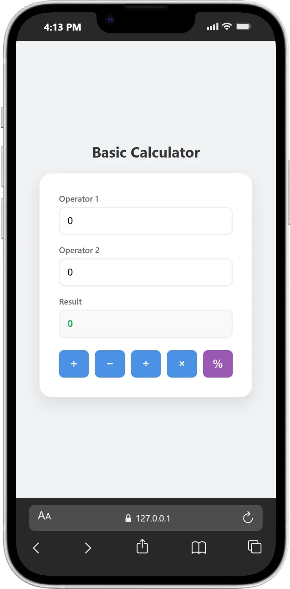
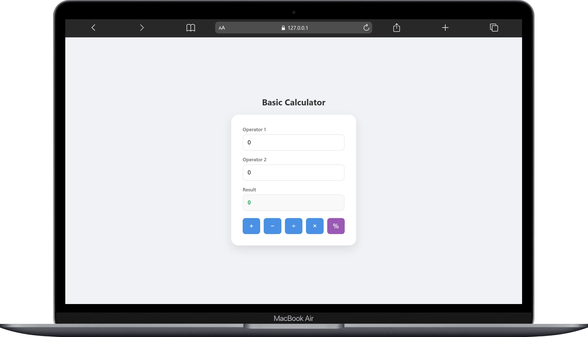

# Basic Calculator

This is a simple calculator built with HTML, CSS and JavaScript

## Features

- Addition
- Subtraction
- Division
- Multiplication
- Percentage

## Technologies

- HTML
- CSS
- JavaScript

## What I learned

- DOM manipulation
- JavaScript functions
- Handling user input
- Basic CSS styling
- Data input, processing, and output

## Preview

<p align="center">
  
  
</p>

## How to Use

1. Enter the first number
2. Enter the second number
3. Click on one of the operation buttons (+, -, ÷, ×, %)
4. View the result displayed on the screen

## How to Run

1. Clone this repository:

```bash
git clone https://github.com/mateusasilva-dev/information-systems/basic-calculator.git
```

2. Open the project folder

3. Open the `index.html` file in your browser

#
